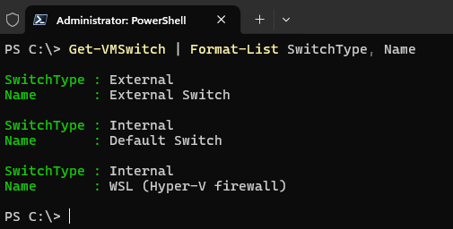

# Grafana Deployment

> This Docker configuration is intended for a local environment with the following resources:

| # |  Resource Name  |                          Description                          |
| :-: | :-------------: | :------------------------------------------------------------: |
| 1 | Hyper-V Cluster | Setup uses a traditional configuration with a bridged network. |
| 2 |      WSL 2      |            I chose Debian as the operating system.            |
| 3 | Docker Desktop |             It´s using Hyper-V and WSL as engine.             |
| 4 |       NAS       |           With NFS partition is mounted on the host.           |

## Hyper-V

> On the hypervisor is installed 3 VMs that has a K8s cluster configured.
>
> These command and its output provide a clear and concise view of the network configuration and running virtual machines in Hyper-V environment

```powershell
Get-VM | Where-Object {$_.State -eq 'Running'} | Format-Table Name, State, CPUUsage, MemoryAssigned
```



```powershell
 Get-VMSwitch | Format-List SwitchType, Name
```


## WSL 2

> For this setup, WSL 2 is used with Debian as the chosen operating system. Here are the steps to configure WSL 2:

1. Enable Required Features:
   Open PowerShell as an administrator and run the following commands to enable the necessary features for WSL2:

   ```powershell
   dism.exe /online /enable-feature /featurename:Microsoft-Windows-Subsystem-Linux /all /norestart
   dism.exe /online /enable-feature /featurename:VirtualMachinePlatform /all /norestart
   ```
1. Install WSL 2:
   Ensure that WSL 2 is installed and set as the default version. Open PowerShell and run:

   ```powershell
   wsl --install
   wsl --set-default-version 2
   ```
1. Install Debian:
   From the Microsoft Store, install Debian (or your preferred Linux distribution).

1. Set up Debian:
   Open Debian from the Start Menu and complete the initial setup.

## Docker Desktop

Ensure Docker Desktop is configured to use the WSL 2 backend:

- Open Docker Desktop.
- Go to `Settings` > `General`.
- Check the option Use the WSL 2 based engine.

Integrate Debian with Docker: 

- In Docker Desktop, go to `Settings` > `Resources` > `WSL Integration` and enable integration with your Debian distribution.

## NAS

> The NAS is configured with a public NFS partition that does not require credentials, allowing it to be easily mounted on the host (Windows 11 Pro). Here are the steps to mount the NFS partition:


1. Mount the NFS Partition:
   Open PowerShell as an administrator and run the following command to mount the NFS partition:

   ```powershell
   mount -o anon \\<NAS_IP>\path\to\nfs\share Z:
   ```
   Replace <NAS_IP> with the IP address of your NAS and `path\to\nfs\share` with the path to your NFS share. `Z:` is the drive letter that will be used for the mounted NFS share.

1. Verify the Mount:
   After mounting, you can verify the NFS share is accessible by navigating to the drive letter in File Explorer.
