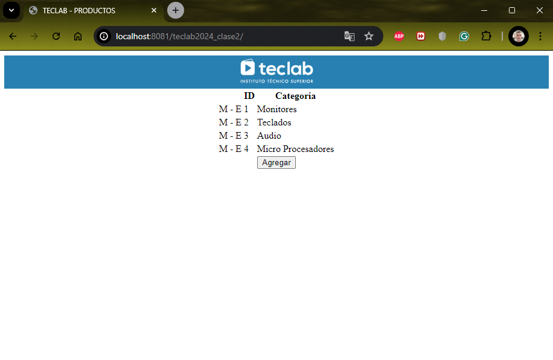

# Proyecto de Desarrollo Web con Docker

Este proyecto contiene una configuración para desarrollar y probar aplicaciones PHP con NGINX y PostgreSQL usando Docker. La configuración asegura que los contenedores se reinicien automáticamente después de un reinicio del sistema y que las extensiones necesarias de PHP estén instaladas.

## Estructura del Proyecto

| Directorio | Descripcion |
| :-: | - |
| MIPROYECTO | Es un nombre aleatorio creado para realizar pruebas y seria la raiz de directorios que contiene todos los archivos, en mi caso utilice este nombre generico, pero puede ser utilizado cualquier nombre, siempre y cuando el contenido sea el mismo que figrua mas abajo. |
| src | En este directorio es donde debe crearse todo lo que se quiera testear como ejemplo se encuentran creadas diferentes carpetas con pequeños desarrollos simples los cuales permitira testear via navegador web el contenido creado de forma dinamica. |

```bash
    MIPROYECTO
    │   docker-compose.yml
    │   fastcgi-php.conf
    │   nginx.conf
    │   README.md
    │   
    ├───img
    │       1.png
    │       2.png
    │       
    └───src
        ├───teclab2024_clase1
        │   │   index.php
        │   │   
        │   ├───assets
        │   │   ├───css
        │   │   │       main.css
        │   │   │       
        │   │   ├───img
        │   │   │       teclab.png
        │   │   │       
        │   │   └───js
        │   └───views
        │           home.html
        │
        └───teclab2024_clase2
            │   index.php
            │   
            ├───assets
            │   ├───css
            │   │       main.css
            │   │       
            │   ├───img
            │   │       teclab.png
            │   │       
            │   └───js
            │           main.js
            │
            └───views
                    home.html
```

## Descripcion de archivos

Es necesario saber que hace cada archivo, pero NO asi para que sirve, el proposito de este documento no es brindar tutoria sobre Docker sino mas bien brindar una herramienta para que, quien esta estudiando HTML, CSS, PHP, SQL, Javascript pueda utilizarla.

| Archivo | Descripcion |
| :-: | - |
| docker-compose.yml | Define y configura los servicios de Docker que componen la aplicación. En este archivo se especifica la imagen de NGINX, la imagen de PHP-FPM, las políticas de reinicio, los volúmenes montados y las redes. Es fundamental para levantar y gestionar los contenedores de manera coordinada. |
| fastcgi-php.conf | Contiene configuraciones específicas para manejar las solicitudes PHP mediante FastCGI. Este archivo es incluido en la configuración de NGINX para asegurar que las solicitudes a archivos PHP sean procesadas correctamente por PHP-FPM. |
| nginx.conf | Configura el servidor web NGINX. Define cómo NGINX debe manejar las solicitudes HTTP, incluyendo el enrutamiento a los archivos PHP, la gestión de archivos estáticos como CSS y JS, y la configuración de la raíz del documento. Es crucial para el funcionamiento del servidor web. |
| README.md | Proporciona una descripción general del proyecto, incluyendo la estructura del directorio, la función de cada archivo, y las instrucciones para iniciar y detener los contenedores Docker. Sirve como guía para cualquier desarrollador que desee utilizar o contribuir al proyecto. |

## Requisitos

Para utilizar este proyecto, necesitas tener instalados los siguientes requisitos:

1. Docker Desktop: Es necesario para crear y administrar contenedores Docker en tu máquina local.
   [Descargar Docker Desktop](https://www.docker.com/products/docker-desktop/)

1. Git: Para clonar el repositorio y realizar control de versiones.
   [Descargar Git](https://git-scm.com/downloads)

1. Editor de Código: Un editor como Visual Studio Code para editar los archivos del proyecto.
   [Descargar Visual Studio Code](https://code.visualstudio.com/download)

## Uso

### Iniciar los contenedores

Para iniciar los contenedores, ejecuta el siguiente comando:

```bash
    cd MIPROYECTO
    docker-compose up -d
```


### Detener los contenedores

Para detener los contenedores, ejecuta:

```bash
    cd MIPROYECTO
    docker-compose down
```


### Reinicio Automático de Contenedores

Los contenedores están configurados para reiniciarse automáticamente en caso de fallo o reinicio del sistema con la política restart: always.

## Navegar a las Pruebas Específicas:

Añade el nombre de la carpeta correspondiente a la prueba que deseas realizar. Por ejemplo:

- Para acceder a la prueba de teclab2024_clase1, escribe:

```bash
http://localhost:8081/teclab2024_clase1/
```


- Para acceder a la prueba de teclab2024_clase2, escribe:

```bash
http://localhost:8081/teclab2024_clase2/
```


### Explicación

- Raíz del Servidor Web: La dirección URL **http://localhost:8081/** es la raíz de nuestro servidor web donde NGINX está configurado para servir contenido.
- Pruebas Dinámicas: Las carpetas teclab2024_clase1 y teclab2024_clase2 son ejemplos de diferentes pruebas que se pueden realizar. Cada carpeta creada bajo el directorio src permite navegar y visualizar los archivos PHP y otros contenidos que hayas creado.

Cualquier nueva carpeta que agregues al directorio src será accesible de la misma manera, facilitando así el desarrollo y la prueba de diferentes proyectos o módulos.
